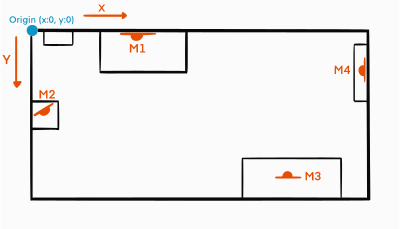
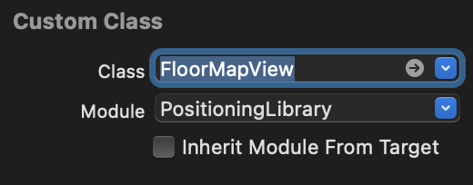

<div align="center">
    <h1>PositioningLibrary</h1>
    
</div>

>La libreria permette allo sviluppatore di accedere alla posizione e all'orientamento del device in uno spazio indoor, attraverso poche righe di codice. La libreria usa delle tecniche di Indoor Positioning basate sull'Augmented Reality, in particolare concentrate sul riconoscimento di **Marker** grafici nello spazio circostante.
---
La libreria fornisce aggiornamenti di posizione attraverso un'istanza della classe `LocationProvider`, a cui vengono forniti una serie di oggetti definiti dall'utilizzatore:
- `Building`: identifica una struttura
- `Floor`: identifica un singolo piano di una struttura (*Building*)
- `Marker`: identifica un marker, ha una *Location* che lo localizza in un *Floor*
- `Location`: identifica una **pose** (posizione e orientamento) rispetto all'origine degli assi del *Floor* di appartenenza
---
## :round_pushpin: Posizionamento dei Marker
I Markers andranno posizionati nel piano da tracciare, e successivamente andranno definite le relative pose. 
- La **pose** di un Marker è definita da:
    -  **x,y** a partire dall'origine, espresse in metri
    - **heading** (orientamento) rispetto all'origine, espresso in radianti
    <p align = "center">
        
    </p>
    <p align = "center">
    Esempio di Floor (in questo caso una piccola stanza) con i relativi Markers
    </p>
- :large_orange_diamond: M1 = <x:1.95, y:0>, heading: 0
- :large_orange_diamond: M2 = <x:0.33, y:0.88>, heading: -0.785
- :large_orange_diamond: M3 = <x:3.82, y:1.87>, heading: 3.14
- :large_orange_diamond: M4 = <x:5.10, y:0.85>, heading: 1.57
---
## :hammer: Uso
1. Per ricevere gli aggiornamenti di posizione è necessario rendere la propria classe aderente al protocollo `LocationObserver`, implementandone i relativi metodi.
Una classe che aderisce a `LocationObserver` riceve aggiornamenti per quanto riguarda il cambio di posizione, attraverso gli oggetti:
    - `ApproxLocation`, ovvero coordinate, orientamento, raggio e angolo di approssimazione (tramite `onLocationUpdate`)
    - `Floor` (tramite `onFloorChanged`)
    - `Building` (tramite `onBuildingChanged`)
2. È necessario definire i dati che verranno usati dalla libreria per il calcolo della posizione. Sono rese possibili due modalità.
    >:warning: È necessario che gli IDs di Building, Floor e Marker siano differenti tra di loro.

    - __Creazione Dinamica__
        - L'utente definisce dinamicamente i dati, definendo i vari Buildings, Floors e ovviamente Markers. Ogni `Marker` avrà un riferimento ad una immagine che dovrà essere inserita negli **Assets** del progetto. Inoltre per ogni `Marker` si dovrà definire la propria `Location`, con coordinate e orientamento riferite all'origine degli assi del relativo `Floor` (es. angolo in alto a sinistra del piano).
        Una volta definiti i dati, possiamo istanziare un oggetto della classe `LocationProvider` passandogli la **ARView** della nostra app (necessaria visto che usamiamo tecniche di AR) e la lista dei `Marker` appena creati. Poi sull'oggetto `LocationProvider` sarà possibile registrare la nostra classe come `LocationObserver` e successivamente richiamare il metodo `start()` per far iniziare il calcolo della posizione. 
        
        - Esempio:
        ```swift
                let b1 = Building(id: "b1", name: "MoMA", coord: CLLocationCoordinate2D(latitude: 40.76141278416226, longitude: -73.97759781909012))
                let f_1 = Floor(id: "f1_1", name: "piano terra", number: 0, building: b1, maxWidth: 5.10, maxHeight: 2.43)
                let l1 = Location(coordinates: CGPoint(x: 1.95, y: 0), heading: 0, floor: f_1)
                let l2 = Location(coordinates: CGPoint(x: 0.33, y: 0.88), heading: -0.785, floor: f_1)
                let m1 = Marker(id: "S1", image: UIImage(named: "S1")!, physicalWidth: 0.12, location: l1)
                let m2 = Marker(id: "S2", image: UIImage(named: "S2")!, physicalWidth: 0.12, location: l2)

                let locationProvider = LocationProvider(arView: arView, markers: [m1, m2])
                locationProvider.addLocationObserver(locationObserver: self)
                locationProvider.start()
        ```
        ---

    - __Creazione Statica__
        - L'utente può definire un proprio documento JSON seguendo un determinato schema ([esempio](https://github.com/tirannosario/TestPositioningLibrary/blob/main/TryLibrary/mydata.json) di doc JSON). (Le immagini dovranno essere comunque caricate sugli **Assets** del progetto, il JSON conterrà il riferimento al loro nome). Quindi sarà possibile istanziare un oggetto della classe `LocationProvider` passandogli la **ARView** e il nome del documento JSON. Poi sull'oggetto `LocationProvider` sarà possibile registrare la nostra classe come `LocationObserver` e successivamente richiamare il metodo `start()` per far iniziare il calcolo della posizione. 

        - Esempio:
        ```swift
            let locationProvider = LocationProvider(arView: arView, jsonName: "mydata")
            locationProvider.addLocationObserver(locationObserver: self)
            locationProvider.start()
        ```
---
## :door: Visualizzare la Mappa Indoor
> La libreria permette anche di mostrare la posizione dell'utente all'interno della mappa del piano in cui si trova, aggiornandone la posizione in tempo reale.
1. Per poter mostrare la posizione del device all'interno della mappa è necessario prima di tutto fornire l'immagine della pianta del piano. È possibile inserirla tra gli __Assets__ del progetto e mettere il relativo riferimento nel parametro opzionale `floorMap` nel costruttore del `Floor`.
```swift
let floor0 = Floor(id: "f1_1", name: "piano terra", number: 0, building: b1, maxWidth: 8.16, maxHeight: 5.3, floorMap: UIImage(named: "piano0")!)
```
- Nel caso dell'uso di __creazione statica__ dei dati, si inserisce il riferimento al nome nel campo `floorMap` nel documento JSON.
> :warning: È **necessario** che l'immagine caricata sia senza sfondo (ad esempio .png) e senza nessun padding (no spazi tra inizio immagine e inizio mappa). Inoltre la punta in alto a sinistra della mappa deve coincidere con l'origine del Floor scelto nel momento del caricamento dei Marker. Quindi ad esempio per il floor dell'esempio precedente, l'immagine sarà questa: <p align = "center"></p>

2. È possibie mostrare la mappa indoor attraverso il componente `FloorMapView`, che può essere visualizzato in diverse maniere:
    - Da **codice**: L'oggetto `LocationProvider` mette a disposizione il metodo `showFloorMap` che si occupa di mostrare a schermo la mappa. Quando si invoca `showFloorMap` è necessario passare l'oggetto `CGRect` che indica posizione e grandezza del `FloorMapView` da visuallizare.
    ```swift
    self.locationProvider.showFloorMap(CGRect(x: 20, y: 40, width: 247, height: 323))
    ```
    ---
    - Utilizzando il componente nello **Storyboard**: Semplicemente si trascina un componente View dalla Object Library nel View Controller e si sette la relativa classe a `FloorMapView`.
        <p align = "center">
            
        </p>
    Successivamente si dovrà creare un Outlet per la `FloorMapView`, aggiungerla come subView della View principale e registrare il componente come Observer del `LocationProvider`.
    ```swift
    arView.addSubview(floorMapView)
    self.locationProvider.addLocationObserver(locationObserver: floorMapView)
    ```
---
 ## :eyes: Demo
 Alla seguente [repo](https://github.com/tirannosario/TestPositioningLibrary) è presente una semplice app iOS che fa uso della libreria, mostrando a schermo sia i dati della **pose** dell'utente, sia la mappa con la posizione.